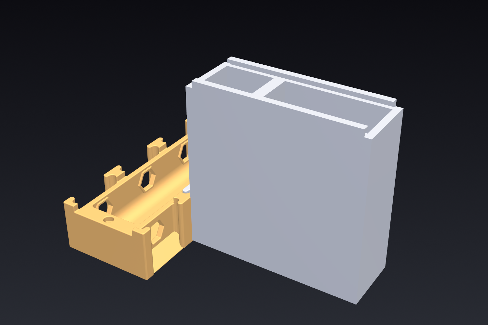

# Ant nest water reservoir

A refillable water/hydration module for the **Slide Ant Nest** system by
CanisMinor ([MakerWorld model 565369](https://makerworld.com/en/models/565369-slide-ant-nest-h1-nest-hub)).
It plugs straight into any **H1 Nest Hub** port.

It connects on its **short end** and stands ~76 mm tall (a 3-inch column) so it holds
plenty of water while sticking straight out from one hub port without covering the others. A single **75 × 25 mm glass microscope
slide** slides into side grooves as the whole top lid — pull it out to refill or to
watch the ants. The main box is a tall **water reservoir (~65 mL)**; a **sponge/cotton
wick** carries water into a shallow **drinking dish with a grate** at the connector
end, so ants drink without drowning and the dish never floods.




## How the fit is guaranteed

The connector is not re-modelled by eye — `build.py` **imports the real
`Connection Cap - M` dovetail** (`vendor/connection-cap-m.step`), rotates it into
place, and cuts an ant passage through it. So the part slides into a hub port with
exactly the same motion (and the same fit) as inserting a stock connection cap.

The ant passage is aligned to the hub's port opening (centre at **Y = 12.5 mm**).

## How it works

A **wick-fed waterer** under a **sliding glass lid**. Side view (connector on the
left, plugs into the hub; reservoir projects right):

```
glass ◀────────── 75 × 25 mm slide (slides out either way) ──────────▶
      ▏┌───────┬─────┬────────┬──────────────────────────┐▕ groove + lip
hub   ▏│ dish  │ well│ solid  │                           │▕
──────╫┤▤grate▤│  ▓  │ divider│  ░░░ WATER RESERVOIR ~65 mL │▕
ants  ║┤▁basin▁│▓▓▓ ═╪═ cotton╪═ ░░░░░░░░░░░░░░░░░░░░░░░░░░ │▕
──────╫┤░░░░░░░│▓▓▓  │████████│  ░░░░░░░░░░░░░░░░░░░░░░░░░░░ │▕
      ▏└───────┴─────┴────────┴────────────────────────────┘▕
       ↑ connector    ↑ cotton well   ↑ low feed hole (cotton) at water level
```

The water path: a cotton plug fills the **low feed hole** through the divider (at
water level), so reservoir water passes straight across into the **cotton well** and
the **basin under the grate**, where the ants drink. The cotton regulates the flow.

* **Sliding glass lid** – a standard 75 × 25 mm microscope slide drops into a groove
  in each side wall (with a retaining lip above). Both ends are open, so it slides
  in / out **either way** and is held only by the two side rails. It's the whole top:
  slide it out to refill the reservoir, and it gives you a clear window to watch the
  ants drink. (The body is 27.5 mm wide to host the grooves.)
* **Reservoir** – the main box holds the water; refill by sliding the glass out.
* **Low feed hole + cotton** – a hole through the divider at water level. You plug it
  with cotton, which lets the water wick across into the dish while restricting a free
  gush. **Note:** because the reservoir is open (not sealed), the cotton is what keeps
  the dish from over-filling — keep the fill level modest and use a snug plug.
* **Cotton well + basin** – the grate stops short of the divider, leaving an open
  well so you can push the cotton down into the feed hole. Water spreads into the
  **basin beneath the grate**, right under where the ants drink.
* **Grate** – fused into the base, sitting **below the nest passage (top at 8 mm vs the
  passage floor at 9 mm)** so it never blocks the entrance. Ants stand on it and drink
  the basin through the slots without drowning.

## Build

```bash
cd ant-nest-reservoir
python build.py                 # base.stl
python build.py --part base
python build.py --part assembly # includes the hub + glass, to preview the fit
python build.py --height 90     # even taller tank (more water); default is 76.3
```

> On this machine use `python3` (plain `python` is the Windows Store shim).

Parts:

| File | What |
|------|------|
| `base.stl` | Reservoir + connector + drinking dish + **fused grate** (one print) |
| `assembly.stl` | Base + glass + hub, for a visual fit check only |

You also need, off the shelf:

* a **75 × 25 mm glass microscope slide** (~1 mm thick) — this is the lid
* a small **sponge or cotton** strip (~10 mm wide) for the wick

## Print settings

| Setting | Recommendation |
|---------|----------------|
| Material | PETG (water-safe, tougher) or PLA |
| Walls | **4+ perimeters** (watertight) |
| Infill | 15–20% |
| Base orientation | As modelled: floor down, open side **up** (connector tenon horizontal) |
| Grate | Fused into the base; sits on internal ribs so it bridges cleanly (no external supports needed in the dish) |
| Glass groove | Prints as an overhang along the top edges; ~1 mm lip bridges fine. Test-fit the slide and sand the groove lightly if it's tight |

Use **3–4 perimeters** and leak-test the reservoir with water. No airtight seal is
required — the wick, not a vacuum, is what keeps the dish from flooding.

## Assembly & use

The grate is part of the base — nothing to drop in.

1. **Fit the wick:** push a damp cotton / sponge plug into the **low feed hole** in the
   divider (from the cotton-well side), so it fills the hole and pokes into both the
   reservoir and the basin. A snug plug is important — it's what stops the reservoir
   from over-filling the dish. Keep it below the glass line so it doesn't snag the slide.
2. **Fill** the reservoir with water. Start with a modest fill and watch how the dish
   behaves; if the basin pools too high, lower the fill level or use a tighter plug.
3. **Slide the glass in** from either end so it covers the whole top (it rides in the
   two side rails).
4. Slide the connector **into a hub port**, like a stock connection cap.
5. **Refill** when low: slide the glass part-way out to expose the reservoir, top up,
   slide it back. Replace the wick if it gets fouled.

> If the dish looks dry, make sure the wick reaches the water and is damp to start
> (prime it under a tap). If the dish ever pools too much, use a smaller/tighter wick.

## Tuning (top of `build.py`)

| Param | Meaning |
|-------|---------|
| `GLASS_L` / `GLASS_W` / `GLASS_T` | Slide size (default 75 × 25 × 1 mm); drives length + width |
| `FOOT_X` | Overall length (default sized so the 75 mm slide covers the top) |
| `HEIGHT` | Reservoir height (deeper = more water) |
| `FOOT_Z` | Width (27.5 mm = slide + groove engagement + lip) |
| `VEST_X2` | Length of the drinking dish |
| `WICK_W` / `FEED_TOP` | Cotton feed-hole width and height (bigger = faster feed) |
| `GRATE_SEAT` | Grate height (kept below the passage floor so it can't block entry) |
| `SLOT_W` | Grate slot width |
| `PASSAGE_W`, `PASSAGE_H` | Ant tunnel size |

## Credit / license

The connection geometry is derived from **CanisMinor's "Slide Ant Nest"**
(`vendor/*.step`), licensed **CC BY-NC-SA**. This reservoir is a compatible add-on;
keep attribution and the same non-commercial license if you share it.
